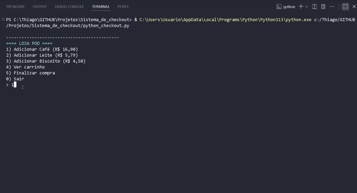

# 🛒 Demo POO - Sistema de Checkout Extensível

Um projeto educacional que demonstra os 4 pilares da **Programação Orientada a Objetos (POO)** através de um sistema de e-commerce simplificado em Python.

> **Autor:** `Thiago Carvalho Rodrigues`  
> **Linguagem:** `Python 3.10+`  
> **Paradigma:** `Orientado a Objetos`

## 🎯 Sobre o Projeto

Este é um sistema de checkout que simula uma loja online, permitindo adicionar produtos ao carrinho e finalizar compras com diferentes métodos de pagamento.

O foco principal é demonstrar como a POO, através de conceitos como **Abstração** e **Polimorfismo**, possibilita que o sistema seja facilmente extensível. Você pode adicionar novos métodos de pagamento (como *PayPal*, *Criptomoeda*, etc.) **sem alterar** o código principal do checkout.

## 📚 Os 4 Pilares da POO na Prática

Este projeto foi desenhado para ser um exemplo didático dos 4 pilares da POO:

* 🏛️ **Abstração**
    * A classe abstrata `Pagamento` define o "contrato" (uma interface) que todas as formas de pagamento devem seguir, obrigando a implementação do método `pagar()`.

* 🧬 **Herança**
    * As classes `Pix`, `CartaoCredito` e `Boleto` **herdam** da classe `Pagamento`. Elas reutilizam a interface definida pela classe-mãe e implementam seus próprios comportamentos específicos.

* 📦 **Encapsulamento**
    * Atributos sensíveis, como o `_saldo` da conta Pix ou o `_limite` do cartão, são protegidos (privados). O acesso a eles é controlado por métodos (como `pagar()`) ou `properties`, evitando manipulação externa direta e garantindo a integridade dos dados.

* 🦋 **Polimorfismo**
    * A função `processar_checkout()` é o exemplo máximo de polimorfismo. Ela é capaz de aceitar *qualquer objeto* que seja do tipo `Pagamento` (seja Pix, Cartão ou Boleto) e chamar o método `pagar()`, sem precisar saber os detalhes internos de como cada um funciona.

## ✨ Funcionalidades

* Menu interativo para simular a jornada de compra.
* Adição de múltiplos produtos ao carrinho.
* Visualização do carrinho com cálculo de subtotal e total.
* Finalização de compra com 3 métodos de pagamento distintos:
    * **PIX** (simula validação de saldo)
    * **Cartão de Crédito** (simula validação de limite)
    * **Boleto** (simula geração de linha digitável)

## 🚀 Como Executar o Projeto

**Pré-requisitos:** Você precisa ter o [Python 3.10](https://www.python.org/downloads/) ou superior instalado.

1.  **Clone este repositório:**
    ```bash
    git clone https://github.com/ThiagoCarvlh/Sistema_de_checkout_POO.git

2.  **(Opcional, mas recomendado) Crie e ative um ambiente virtual:**
    ```bash
    # Criar o ambiente
    python -m venv .venv
    
    # Ativar no Windows (PowerShell)
    .\.venv\Scripts\Activate.ps1
    
    # Ativar no Linux/macOS
    source .venv/bin/activate
    ```

3.  **Execute o sistema:**
    ```bash
    python checkout.py
    ```

## ▶️ Demonstração em Vídeo




## 💡 A Mágica da Extensibilidade

Imagine que, no futuro, sua loja precise aceitar **PayPal**.

Graças ao design em POO, você **não precisa modificar** a função `processar_checkout()` ou qualquer outra parte do sistema. Basta você criar uma nova classe que herde de `Pagamento` e obedeça ao "contrato":

```python
# Crie o novo método de pagamento
class PayPal(Pagamento):
    def __init__(self, email: str):
        self._email = email

    def nome(self) -> str:
        return "PayPal"
    
    def pagar(self, valor: float) -> bool:
        print(f"Conectando ao PayPal com o e-mail {self._email}...")
        print(f"Processando R$ {valor:.2f} via PayPal...")
        print("Pagamento via PayPal aprovado!")
        return True
        
```
## 🔧 Conceitos Técnicos Aplicados

* Classes abstratas (ABC e @abstractmethod)

* Herança e sobrescrita de métodos

* Type Hints (Tipagem estática)

* Properties (@property) para controle de acesso

* Formatação de strings (f-strings)

* Separação clara de responsabilidades (cada classe tem uma única função).
